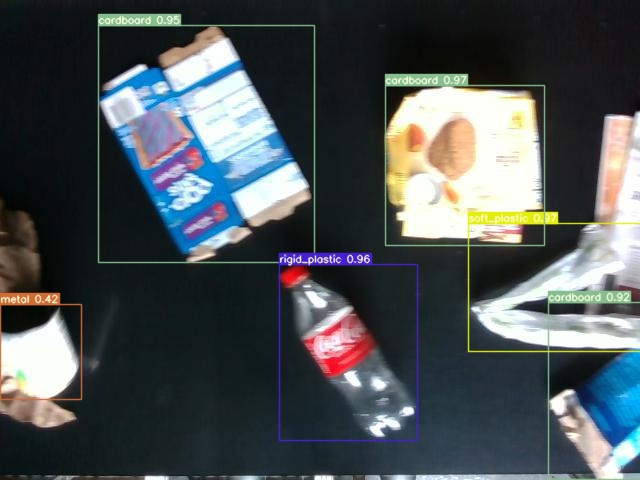
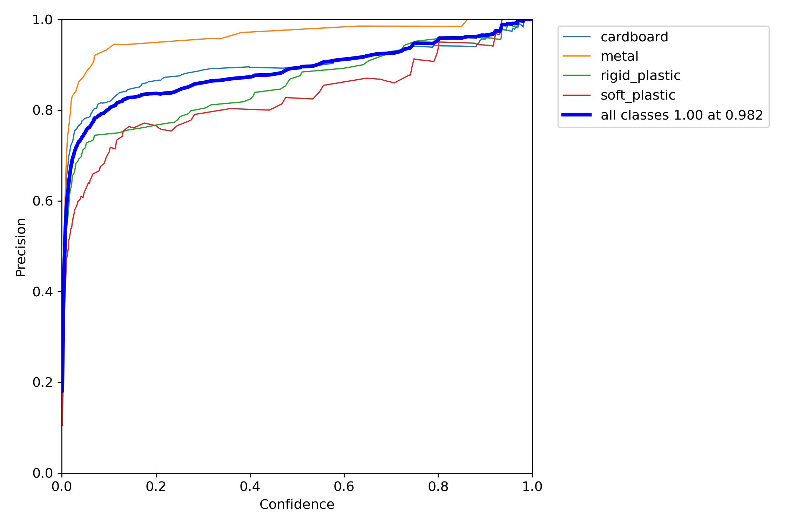

# Green Sorter  

Mô hình này được thiết kế để phát hiện các vật liệu có thể tái chế trong thời gian thực với độ chính xác cao. Bằng cách sử dụng Yolov7, mô hình này có thể phân loại chính xác các loại vật liệu khác nhau, bao gồm các tông, kim loại, nhựa cứng, nhựa mềm. Điều này cho phép các công ty và tổ chức sắp xếp và tái chế chất thải hiệu quả hơn, giảm tác động môi trường và tiết kiệm các nguồn lực có giá trị. Mô hình này có thể dễ dàng tích hợp vào các hệ thống quản lý chất thải hiện có và có khả năng cải thiện đáng kể hiệu quả tái chế. Với tầm quan trọng ngày càng tăng của tính bền vững và nhu cầu giảm chất thải, AI này là một công cụ có giá trị cho các doanh nghiệp và tổ chức tìm cách tạo ra tác động tích cực đến môi trường.

## Installation

Clone repo

```bash
  git clone https://github.com/1nfinityLoop/GreenSorter
```

Download model 


[`Download`](https://github.com/1nfinityLoop/GreenSorter/releases/download/v0.1/model.pt)


## Testing

Clone repo

```bash
  python yolov7/detect.py --weights model.pt --source "video.mp4"

```

## Dataset


Để đào tạo mô hình này, tôi đã sử dụng bộ dữ liệu mà tôi tìm thấy [here](https://universe.roboflow.com/kaitlyn-fichtner-nv5um/lab-trash-v2.0) 

Bạn cũng có thể tìm thấy dữ liệu đào tạo, xác nhận và kiểm tra trong repo này


```bash
Train: train/images

Val: valid/images

Test: test/images

nc: 4

Names: ['cardboard', 'metal', 'rigid_plastic', 'soft_plastic']
```
## Results
 <br><br>
Output :
 <br><br>



<br><br><br><br>
Precision : 
<br><br>


